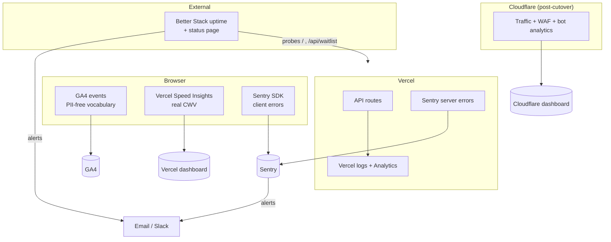

# Monitoring & Analytics — Tooling Evaluation and Recommended Stack

> **Purpose:** Evaluate the monitoring/analytics tools relevant to the Orgofin website, recommend a concrete stack sized to a pre-seed frontend site, define the ideal monitoring architecture, and state exactly what to check daily/weekly/monthly.
> **Applies to:** engineering and founders operating the live site.
> **Classification:** Internal.

---

## Responsibilities

Owns the post-launch observability decision and cadence. Complements [`operating-the-website.md`](./operating-the-website.md) (broader operations) and the [`../launch/launch-playbook.md`](../launch/launch-playbook.md) (launch-window monitoring). Reflects the current stack: GA4 already integrated (`@next/third-parties`, production-only), Vercel hosting, Supabase BaaS, Cloudflare pending.

---

## 1. What Actually Needs Monitoring

This is a **frontend marketing site with two write endpoints** — not a product with servers, queues, or databases you operate. That right-sizes everything below: you do **not** need Grafana/OpenTelemetry/self-hosted infra for this site. You need: user+product analytics, error tracking, uptime, and (light) API/security signal. Save the heavy observability stack for when the actual Orgofin product platform is built.

---

## 2. Tool-by-Tool Evaluation

| Tool                             | Purpose                                          | Strengths                                                                                             | Weaknesses                                                                                | Pricing                         | Fit for this site                                             |
| -------------------------------- | ------------------------------------------------ | ----------------------------------------------------------------------------------------------------- | ----------------------------------------------------------------------------------------- | ------------------------------- | ------------------------------------------------------------- |
| **Google Analytics 4**           | User + product analytics                         | Free, ubiquitous, already integrated, funnels/events, audience data                                   | PII/consent complexity (esp. DPDP/GDPR), sampling, unfriendly UI, not real-time debugging | Free                            | ✅ **Keep** — already wired, PII-safe event vocabulary        |
| **Vercel Analytics**             | Web analytics + Speed Insights (real CWV)        | Zero-config on Vercel, privacy-friendly, **real Core Web Vitals field data**, no cookie banner needed | Paid beyond hobby limits; less deep than GA4 for funnels                                  | Free tier; paid past event caps | ✅ **Add** — best source of real CWV; complements GA4         |
| **Cloudflare Web Analytics**     | Privacy-first web analytics                      | Free, no cookies, server-side (ad-blocker resistant), no consent banner                               | Basic (pageviews/referrers), no deep funnels                                              | Free                            | ⚠️ Optional — nice free traffic truth-source if on Cloudflare |
| **Cloudflare Analytics**         | Edge/WAF/traffic + security analytics            | Comes with Cloudflare proxy; bot/threat/rate-limit visibility                                         | Only meaningful once domain is proxied through CF                                         | Included                        | ✅ **Add at domain cutover** — your security signal           |
| **PostHog**                      | Product analytics + session replay + flags       | Powerful funnels, replay, feature flags, self-host option, generous free tier                         | Heavier client script; overkill for a 4-page marketing site today                         | Free 1M events/mo; paid after   | ⚠️ Later — great when the product exists; premature now       |
| **Sentry**                       | Error + performance tracking                     | Best-in-class error grouping, source maps, releases, Next.js SDK, alerting                            | Client bundle weight; quota management; PII scrubbing needed                              | Free 5k errors/mo; paid after   | ✅ **Add** — the one true gap in current observability        |
| **Better Stack** (Logs + Uptime) | Uptime monitoring + log management + status page | Clean UX, uptime + on-call + status page in one, good free tier                                       | Log ingestion costs scale; overlaps others                                                | Free tier; paid after           | ✅ **Add** — uptime + status page in one                      |
| **Logtail**                      | Log management                                   | (Now part of Better Stack) structured logs, SQL-ish search                                            | Cost at volume; not needed for a static site's thin logs                                  | Free tier                       | ⚠️ Optional — Vercel logs suffice initially                   |
| **UptimeRobot**                  | Uptime monitoring                                | Dead-simple, generous free tier (50 monitors)                                                         | Basic; 5-min interval on free; no integrated status page polish                           | Free; paid for 1-min            | ✅ Alt to Better Stack if you want the simplest thing         |
| **Grafana**                      | Dashboards over metrics                          | Powerful, flexible, open-source                                                                       | Needs a metrics backend + ops effort; overkill here                                       | Free OSS; Cloud paid            | ❌ Not now — no infra to visualize                            |
| **OpenTelemetry**                | Vendor-neutral instrumentation                   | Standard, future-proof, avoids lock-in                                                                | Real setup cost; value appears with distributed services                                  | Free (spec)                     | ❌ Not now — adopt with the product backend                   |

---

## 3. Recommended Stack

**Right-sized for a pre-seed frontend site, mostly free tiers:**

| Layer                          | Tool                                                                                       | Why                                                                        |
| ------------------------------ | ------------------------------------------------------------------------------------------ | -------------------------------------------------------------------------- |
| User analytics                 | **GA4** (already integrated)                                                               | Audiences, sources, conversions; PII-safe event union already in code      |
| Product analytics (conversion) | **GA4 events** (`waitlist_submit`, `cta_click`, `data_room_request`, `data_room_download`) | Already typed and firing; extend the union, never ad-hoc                   |
| Performance (real CWV)         | **Vercel Speed Insights + Analytics**                                                      | Field CWV that Lighthouse can't give you; zero-config                      |
| Error tracking                 | **Sentry** (Next.js SDK)                                                                   | The current gap; client + server errors, releases, alerting, PII scrubbing |
| Uptime + status page           | **Better Stack** (or UptimeRobot for simplest)                                             | Watch `/` and `/api/waitlist`; alert on downtime; public status page       |
| API/security/edge              | **Cloudflare Analytics + WAF events** (at domain cutover)                                  | Bot/threat/rate-limit visibility                                           |
| Logs                           | **Vercel logs** (native) + Sentry breadcrumbs                                              | Sufficient at this scale; add Better Stack log ingestion only if needed    |

**Defer** PostHog, Grafana, OpenTelemetry, dedicated log platforms until the product platform exists.

**Total cost at launch scale: ~$0** (free tiers), scaling to low tens of dollars/month only if traffic/errors exceed free quotas.

---

## 4. Ideal Monitoring Architecture

**Coverage mapping to the requested categories:**

- **User analytics** → GA4. **Product analytics** → GA4 typed events. **Performance monitoring** → Vercel Speed Insights (field) + Lighthouse (lab). **Error tracking** → Sentry. **Uptime** → Better Stack/UptimeRobot. **Server monitoring** → Vercel function metrics + logs (no servers you run). **API monitoring** → uptime probe on `/api/waitlist` + Sentry on route errors + Cloudflare rate-limit stats. **Security monitoring** → Cloudflare WAF/bot analytics + Sentry + rate-limit 429 rates. **Logs** → Vercel logs + Sentry breadcrumbs. **Alerts** → Sentry + Better Stack → email/Slack. **Dashboards** → GA4 + Vercel + Sentry + Cloudflare (four panes; no custom dashboard needed at this scale).

---

## 5. Alerting

Configure and **test-fire** before launch:

- **Uptime:** alert if `/` or `/api/waitlist` is down > 2 consecutive checks.
- **Error rate:** Sentry alert on a spike (e.g. >10 errors in 5 min, or any new issue type in production).
- **Latency:** alert if p95 route latency crosses a threshold (Vercel).
- **Abuse:** alert on a surge of 429s (rate-limit hits) or WAF blocks (Cloudflare) — could be an attack _or_ a false-positive blocking real users.
- **Route alerts to a channel a human actually watches** (email + Slack/WhatsApp). An alert nobody sees is not monitoring.

---

## 6. What to Check — Daily / Weekly / Monthly

### Daily (2 minutes)

- [ ] Uptime dashboard green; no overnight downtime.
- [ ] Sentry: any new/unresolved production errors.
- [ ] GA4 realtime/traffic sanity; waitlist signups landing.
- [ ] Any abuse signal (429 surge, WAF blocks).

### Weekly (15–30 minutes)

- [ ] Traffic + conversion trends (GA4): sources, top pages, waitlist/data-room conversion rate.
- [ ] Core Web Vitals field data (Vercel Speed Insights) — regressions vs last week.
- [ ] Error backlog triaged and burned down (Sentry).
- [ ] Dependency updates (Dependabot PRs) + `npm audit`.
- [ ] Search Console: coverage errors, crawl issues, query performance.
- [ ] Lead quality review + export to owner-controlled store.

### Monthly (1–2 hours)

- [ ] Restore-test a backup (prove recoverability).
- [ ] Review alert thresholds vs real traffic — retune to cut noise/false-positives.
- [ ] Security: run the manual pen-test checklist; review WAF/rate-limit effectiveness.
- [ ] Cost review: Vercel/Supabase/Sentry/Better Stack usage vs free-tier limits.
- [ ] SEO review: rankings, backlinks, indexed pages.
- [ ] Revisit whether the stack still fits (e.g. is it time for PostHog as the product nears?).

---

## Current Status

GA4 integrated (production-only, PII-safe). Vercel hosting in place. Sentry, Vercel Analytics/Speed Insights, uptime monitoring, and Cloudflare analytics are recommended additions not yet wired. No alerting configured yet.

## Future Improvements

- Add PostHog (product analytics + replay + flags) and OpenTelemetry/Grafana when the product platform with real backend services exists.
- Build a single-pane exec dashboard if four consoles becomes friction.

## TODO

- [ ] Wire Sentry with PII scrubbing (`beforeSend`).
- [ ] Enable Vercel Analytics + Speed Insights.
- [ ] Set up Better Stack/UptimeRobot uptime + status page and alert routing.
- [ ] Enable Cloudflare analytics at domain cutover.

## References

- `src/lib/analytics/track.ts` — the typed, PII-free event vocabulary.
- [`operating-the-website.md`](./operating-the-website.md)
- [`../launch/launch-playbook.md`](../launch/launch-playbook.md)

## Related Documents

- [`../security/security-audit-report.md`](../security/security-audit-report.md) (A09 logging/monitoring gap)

---

**Last Updated:** 2026-07-18
**Owner:** Orgofin Engineering (TODO: assign a DRI)
