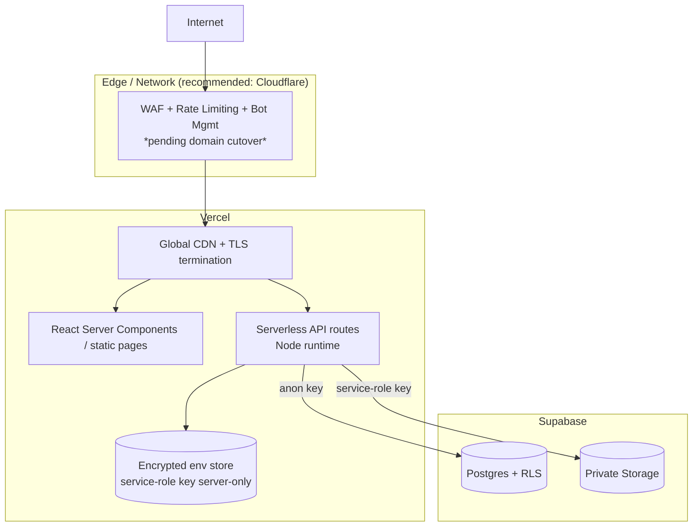

# Security Architecture — Orgofin Website

> **Purpose:** Explains _how security is designed_ into the Orgofin website — the principles, the authentication/authorization model, and each protection layer — at a depth suitable for investors, enterprise-customer security reviews, and due-diligence questionnaires.
> **Applies to:** engineering, founders, and external reviewers.
> **Classification:** Internal — shareable under NDA. Contains no secrets.

---

## Responsibilities

Describes the intended security design of the marketing/waitlist website. For the point-in-time vulnerability findings, see [`security-audit-report.md`](./security-audit-report.md); for how to verify the design holds, see [`security-test-suite.md`](./security-test-suite.md). This document covers the **website only** — the future Orgofin product platform is out of scope (it does not exist in this repository).

---

## 1. Security Design Principles

The website's security posture follows five principles, in priority order:

1. **Minimize the attack surface.** The site is frontend-only with exactly two write-only API endpoints and no authentication, no sessions, no user-generated content, and no user file uploads. Whole vulnerability classes are eliminated by _not building_ the features that create them.
2. **Least privilege at every boundary.** The credential that ships to browsers (Supabase anon key) can only _insert_ rows — it cannot read, update, or delete anything. The powerful credential (service-role key) never leaves the server and is used for exactly one narrow job.
3. **Defense in depth.** Input is validated at the route _and_ again at the data seam; the data room is private-bucket + short-TTL signed URLs + gate + (recommended) rate limit + verification — no single control is the only thing standing between an attacker and an asset.
4. **Secure by default / fail safe.** Missing configuration degrades gracefully (the data room shows "in preparation" rather than crashing or exposing a stack trace); errors return friendly typed messages, never internals.
5. **Auditability.** Conversion analytics are structurally PII-free; the schema is version-controlled; the seam (`lib/api/*`) is the single, reviewable choke point for all data access.

---

## 2. Authentication Flow

**There is no end-user authentication in the website today.** This is a deliberate architectural fact, not an omission: the site is a public marketing surface plus two anonymous lead-capture forms. There are no user accounts, no login, no passwords, no sessions, no JWTs, and no OAuth.

The only "authentication" present is **machine-to-service credential authentication** between the Vercel server and Supabase:

```mermaid
sequenceDiagram
  participant B as Browser
  participant V as Vercel (API route)
  participant DB as Supabase (Postgres + RLS)
  participant ST as Supabase Storage (private)

  B->>V: POST /api/data-room {name,email,firm}
  Note over V: Zod validation (route)
  V->>V: Zod validation again (seam, defense-in-depth)
  V->>DB: insert(lead) using ANON key
  Note over DB: RLS insert-only policy → allowed; no read possible
  DB-->>V: ok
  V->>ST: createSignedUrl(doc, 900s) using SERVICE-ROLE key (server-only)
  ST-->>V: signed URL (15-min TTL)
  V-->>B: 201 {documents:[{url}]}
  Note over B: URL opens PDF directly from Storage; expires in 15 min
```

**Design decision — why no auth:** adding authentication would create sessions, password storage, reset flows, and account-takeover risk for zero product benefit on a marketing site. When the actual Orgofin product (HRMS/Company Brain) is built, it will introduce a full auth model in a _separate_ service behind the `lib/api/*` seam; this document will be superseded for that surface.

---

## 3. Authorization Model

Authorization is enforced **at the database layer via Postgres Row-Level Security (RLS)**, not in application code — the strongest place to put it, because it holds even if the application is compromised.

| Principal                     | Credential            | Capability                                                                                                             |
| ----------------------------- | --------------------- | ---------------------------------------------------------------------------------------------------------------------- |
| Anonymous browser / API route | Supabase **anon** key | `INSERT` only, on `waitlist` and `data_room_requests`. No `SELECT`/`UPDATE`/`DELETE` policy exists → those are denied. |
| Server (signed-URL minting)   | **service-role** key  | Full storage access; used _only_ to `createSignedUrl` on the private bucket. Never touches tables.                     |
| Founder / operator            | Supabase dashboard    | Full access via authenticated Supabase console (human, MFA-protected at the Supabase account level).                   |

**Policy definitions (verbatim intent):**

```sql
alter table public.waitlist enable row level security;
create policy "waitlist_insert_public"
  on public.waitlist for insert to anon, authenticated with check (true);
-- No SELECT/UPDATE/DELETE policy → the anon key cannot read the list back.
```

The identical pattern applies to `data_room_requests`. The consequence is that **even with the anon key (which is public and ships in every browser), an attacker cannot enumerate, read, modify, or delete a single stored record.** The key's entire power is "append a row."

There are no application-level roles or permissions because there are no authenticated users to assign them to. The "authorization" a visitor experiences at the data-room gate is a **business-logic lead gate** (self-asserted identity → instant unlock), not an access-control boundary — this distinction is important and is documented as such in the audit (finding M-01).

---

## 4. Data Protection

| Data                             | In transit                 | At rest                           | Access control                            |
| -------------------------------- | -------------------------- | --------------------------------- | ----------------------------------------- |
| Waitlist emails                  | TLS 1.2+ (Vercel)          | Encrypted (Supabase/Postgres)     | Insert-only RLS; unreadable via anon key  |
| Investor leads (name/email/firm) | TLS 1.2+                   | Encrypted at rest                 | Insert-only RLS; unreadable via anon key  |
| Investor PDFs                    | TLS 1.2+                   | Private bucket, encrypted at rest | Service-role signed URLs only; 15-min TTL |
| Secrets (service-role key)       | N/A (never sent to client) | Vercel encrypted env store        | Server runtime only                       |

- **In transit:** all traffic is HTTPS; Vercel provisions and auto-renews Let's Encrypt certificates. HSTS is a recommended addition (audit H-01) to prevent downgrade.
- **At rest:** Supabase encrypts Postgres data and Storage objects at rest by default.
- **PII minimization:** the site collects only what the lead forms require (email; plus name/firm/optional check-size for investors). Analytics never receives PII — the typed event vocabulary makes it structurally impossible to send an email or name to GA4.
- **Data residency / DPDP note:** because Orgofin is India-first and subject to the DPDP Act, the Supabase project region and a privacy policy covering lead data are compliance items tracked in the operations runbook.

---

## 5. API Protection

Both endpoints share one hardened pattern (`route.ts` → `lib/api/*`):

1. **Body parsing is guarded** — a non-JSON body returns `400 "Invalid request body."` rather than throwing.
2. **Zod validation at the route** — strict schema with `.trim()`, length `.max()` caps, `.email()`, `.toLowerCase()`; unknown fields are dropped (property-level authorization).
3. **Zod validation again in the seam** — defense-in-depth so the data function is safe even if called from a future non-HTTP path.
4. **Parameterized data access** — the Supabase client parameterizes all queries; there is no string-concatenated SQL anywhere, so injection has no sink.
5. **Typed, non-leaky results** — every path returns `{ ok, error? }`; exceptions are caught and converted to friendly messages. No stack trace, driver error, or internal detail reaches the client.
6. **The seam (`lib/api/*`) is the only place that talks to Supabase** — ESLint forbids importing `@supabase/*` from components/pages. This single choke point is what makes the whole data path reviewable and what will let a future backend swap in without touching the UI.

**Recommended additions (audit):** rate limiting (H-02), CAPTCHA/Turnstile (M-02), and an optional Origin check (L-05) to complete the API protection story for a public launch.

---

## 6. File Security

- **No user uploads.** Visitors cannot upload files anywhere in the application — this eliminates malicious-upload, path-traversal, and content-type-confusion risks entirely.
- **Investor documents** are uploaded _only_ by the founder via the authenticated Supabase dashboard into a **private** bucket (`investor-data-room`, public read OFF).
- **Delivery is exclusively via short-lived signed URLs** (15-minute TTL) minted server-side with the service-role key. The bucket is never publicly listable or readable; there is no stable public URL to guess or share long-term.
- **Failure mode is safe:** if signing is unavailable, documents render as "In preparation" — the room never falls back to a public path.

---

## 7. Database Security

- **RLS enabled on every table**, with insert-only policies and no read/update/delete policies for public roles (see §3).
- **UUID primary keys** (`gen_random_uuid()`) — no sequential IDs to enumerate.
- **Environment isolation:** two separate Supabase projects (prod vs shared non-prod) so preview/UAT/dev writes never touch production data or investor-facing counts.
- **Schema is version-controlled** in `supabase/migrations/` — the auditable source of truth.
- **Least-privilege connection:** the app connects with the anon key + `persistSession: false`; the elevated key is reserved for storage signing only.
- **Recommended:** confirm the Supabase plan's backup/PITR coverage and add a periodic lead-table export (audit L-06).

---

## 8. Infrastructure Security



- **Vercel** provides TLS, a global CDN, immutable per-deploy artifacts (enabling instant rollback), and an encrypted environment-variable store scoped per environment (Production / Preview / Development).
- **Secrets segregation:** `NEXT_PUBLIC_` prefix _only_ for values meant to be public (anon key, GA4 ID, site URL); the service-role key deliberately carries no such prefix and is never bundled into client code.
- **Cloudflare (pending E13.1.3):** once the apex domain is attached and the certificate is live, enable the orange-cloud proxy with managed WAF, `/api/*` rate-limiting rules, and bot fight mode. Until then, use "DNS only" to avoid interfering with certificate issuance.
- **CI/CD hardening:** `npm ci` (lockfile-exact installs) + a merge-blocking quality gate, now including a merge-blocking `npm audit --audit-level=high` step, CodeQL SAST, GitHub-native secret scanning + push protection, and Dependabot (audit M-03, wired 2026-07-19).

---

## 9. Production Deployment Security

- **Branch → environment mapping:** `main` → Production, `uat` → Staging, `dev` → Development preview; every PR gets an isolated preview. No direct-to-production pushes; changes flow through PR + CI.
- **Immutable deploys + instant rollback:** every deployment is retained; rollback is a one-click promotion of the last known-good build, not a rebuild.
- **Environment-scoped secrets:** production secrets exist only in the Production scope; previews use the non-prod Supabase project.
- **Recommended pre-deploy security gate (see test suite):** headers/CSP check, `npm audit`, and the manual pen-test checklist before promoting to Production.

---

## 10. Security Posture Summary (for due diligence)

**What a security reviewer should take away:** the Orgofin website is intentionally a _small, hard target_. It stores only low-to-medium-sensitivity lead PII, behind a database credential that can only append rows and cannot read them back. It has no authentication to break, no sessions to hijack, no user content to poison, and no upload surface to abuse. Its powerful credential never leaves the server. Its dependency tree is clean and pinned. The open items before public launch are standard web-hardening measures — security headers, rate limiting, and bot protection — not architectural weaknesses, and each has a documented, low-to-medium-effort remediation.

---

## Current Status

Design as implemented on 2026-07-18. Core controls (RLS, secret segregation, private bucket + signed URLs, validation, typed errors) are in place. Edge hardening (headers/CSP, rate limiting, WAF) is designed and recommended but not yet implemented — tracked in the audit report.

## Future Improvements

When the Orgofin product platform introduces authenticated surfaces, extend this document with the auth service design (sessions/JWT, RBAC, MFA), and re-run the audit against the new threat model.

## TODO

- [ ] Implement the recommended edge controls (headers/CSP, rate limiting, WAF) — see audit H-01/H-02/M-04.
- [ ] Confirm Supabase region for DPDP data-residency and publish a privacy policy.
- [ ] Assign a security DRI.

## References

- [`security-audit-report.md`](./security-audit-report.md)
- [`security-test-suite.md`](./security-test-suite.md)
- [`docs/deployment/data-room-storage.md`](../deployment/data-room-storage.md)
- [`.claude/context/deployment.md`](../../.claude/context/deployment.md)

## Related Documents

- [`docs/deployment/environment-variables.md`](../deployment/environment-variables.md)
- [`docs/adr/0001-frontend-first-no-backend-yet.md`](../adr/0001-frontend-first-no-backend-yet.md)

---

**Last Updated:** 2026-07-18
**Owner:** Orgofin Engineering (TODO: assign a security DRI)
