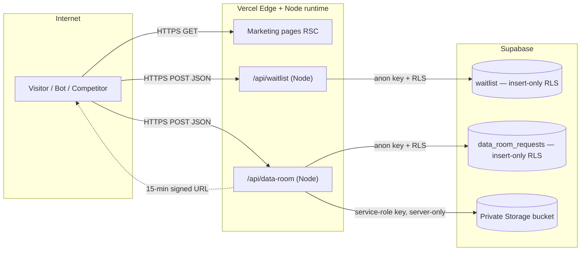

# Security Audit Report — Orgofin Website

> **Purpose:** A complete, adversarial security review of the Orgofin marketing/waitlist website conducted as a pre-public-launch gate. Findings are grounded in the actual codebase (commit on `dev`, 2026-07-18), not assumptions.
> **Applies to:** engineering, founders, and any external party performing security due diligence.
> **Classification:** Internal — safe to share with investors/enterprise reviewers under NDA. Contains no secrets.

---

## Responsibilities

Owns the point-in-time vulnerability assessment, threat model, and risk register for **this repository only** (the marketing/waitlist website). It does **not** cover the future Orgofin product platform (HRMS, Company Brain, AI agents) — none of that exists in this codebase (see [`.claude/context/architecture.md`](../../.claude/context/architecture.md)). Companion documents: [`security-architecture.md`](./security-architecture.md) (how security is designed) and [`security-test-suite.md`](./security-test-suite.md) (how to verify it).

---

## 1. Executive Summary

The Orgofin website is a **small, well-disciplined attack surface**. It is a frontend-only Next.js App Router application on Vercel with Supabase as a backend-as-a-service. There is **no user authentication, no session management, no user-generated content rendered to other users, no file-upload-by-users, and no product data** — the entire dynamic surface is **two write-only public API endpoints** (`/api/waitlist`, `/api/data-room`) that insert a row into a Supabase table protected by insert-only Row-Level Security (RLS).

This architecture eliminates whole classes of vulnerability by construction: no auth means no broken-authentication or session-fixation bugs; insert-only RLS with no SELECT policy means the anon key **cannot read any lead data back**, so IDOR/enumeration of stored records is not possible through the app; strict Zod validation on every input and typed error results mean no stack traces or injection sinks are exposed. Dependency posture is clean (`npm audit` → 0 vulnerabilities), secrets are correctly segregated (service-role key is server-only, never `NEXT_PUBLIC_`), and the codebase contains no `eval`, no unsafe `innerHTML` (the two `dangerouslySetInnerHTML` uses are safe — a static theme script and an escaped JSON-LD blob).

**The material gaps are operational, not architectural.** The three that matter for launch:

1. **No HTTP security headers / CSP** — the app is missing `Content-Security-Policy`, `X-Frame-Options`/`frame-ancestors` (clickjacking), `Strict-Transport-Security`, and related headers. `next.config.ts` is empty and there is no `vercel.json` or middleware. **(High)**
2. **No rate limiting or bot protection on the public write endpoints** — both forms can be scripted to insert unbounded rows (waitlist spam / data-room lead-table flooding), and the data-room gate can be brute-forced open at machine speed to harvest signed URLs. **(High)**
3. **The Data Room is gated by self-asserted identity only** — anyone (including a competitor) who types any name/email/firm gets instant document access. This is a deliberate product decision (E11.1.4), but it must be an informed one, and it should be hardened before genuinely sensitive material is uploaded. **(Medium, by-design — see §5)**

None of these are exploitable for data theft of existing records or code execution. They are abuse-resistance and hardening gaps appropriate to close before a public launch that invites adversarial attention from competitors.

**Overall risk rating (pre-remediation): MEDIUM.** After the High items are closed (est. 1–2 focused days), the residual risk is **LOW** and appropriate for public launch.

### Findings at a glance

| ID   | Finding                                                                                                                        | Severity | Effort | Business impact |
| ---- | ------------------------------------------------------------------------------------------------------------------------------ | -------- | ------ | --------------- |
| H-01 | No security headers / Content-Security-Policy — ✅ **REMEDIATED 2026-07-18**                                                   | High     | Low    | Medium          |
| H-02 | No rate limiting / bot protection on public POST endpoints — ✅ **REMEDIATED 2026-07-18** (app layer; Cloudflare edge pending) | High     | Medium | Medium          |
| M-01 | Data Room access is self-asserted (no verification)                                                                            | Medium   | Medium | High            |
| M-02 | No CAPTCHA / human-verification on forms — ⚠️ **PARTIAL** (honeypot shipped; Turnstile recommended)                            | Medium   | Low    | Medium          |
| M-03 | No automated security scanning in CI (SAST/deps/secrets)                                                                       | Medium   | Low    | Medium          |
| M-04 | No WAF / edge protection configured (Cloudflare not attached)                                                                  | Medium   | Medium | Medium          |
| L-01 | Signed URLs are unwatermarked and shareable within TTL                                                                         | Low      | Medium | Medium          |
| L-02 | No explicit request-body size / content-type hard limit                                                                        | Low      | Low    | Low             |
| L-03 | Error logs may capture PII (email) via Supabase error objects                                                                  | Low      | Low    | Low             |
| L-04 | No `Permissions-Policy` / referrer policy tightening                                                                           | Low      | Low    | Low             |
| L-05 | CORS/Origin not asserted on API routes                                                                                         | Low      | Low    | Low             |
| L-06 | No backup/export procedure for Supabase lead tables                                                                            | Low      | Low    | Medium          |
| I-01 | `BrandSwitcher` effect applies `data-brand` even in prod                                                                       | Info     | Low    | Low             |

Items already implemented correctly are catalogued in **§6**.

---

## 2. Risk Assessment

Risk = Likelihood × Impact, scored for a **public launch that competitors are expected to probe** (the user's explicit threat context).

| Risk                                 | Likelihood | Impact | Rating | Primary control (current → recommended)                               |
| ------------------------------------ | ---------- | ------ | ------ | --------------------------------------------------------------------- |
| Clickjacking / UI redress            | Medium     | Medium | High   | None → `frame-ancestors 'none'` + `X-Frame-Options`                   |
| Form/lead-table spam (bots)          | High       | Low    | Medium | RLS insert-only (no read leak) → + rate limit + CAPTCHA               |
| Data-room signed-URL harvesting      | Medium     | Medium | High   | 15-min TTL + private bucket → + rate limit + verification             |
| XSS (stored/reflected/DOM)           | Low        | High   | Low    | No user content rendered; escaped JSON-LD → + CSP defense-in-depth    |
| Injection (SQL/NoSQL)                | Low        | High   | Low    | Parameterized Supabase client + Zod + RLS (already strong)            |
| Secret leakage                       | Low        | High   | Low    | Service key server-only, gitignored env (already strong)              |
| Dependency / supply-chain compromise | Low        | High   | Medium | Clean `npm audit`, `package-lock` pinned → + CI scanning + Dependabot |
| Denial of service (L7)               | Medium     | Medium | Medium | Vercel platform limits → + Cloudflare/WAF + rate limit                |
| Sensitive-data exposure (leads)      | Low        | High   | Low    | No SELECT policy; service key server-only (already strong)            |
| PII in logs                          | Medium     | Low    | Low    | Structured error results → scrub error objects                        |

---

## 3. Threat Model

### 3.1 Assets

| Asset                               | Sensitivity  | Where it lives                                          |
| ----------------------------------- | ------------ | ------------------------------------------------------- |
| Waitlist emails                     | Medium (PII) | `public.waitlist` (Supabase), insert-only RLS           |
| Investor leads (name/email/firm)    | Medium (PII) | `public.data_room_requests` (Supabase), insert-only RLS |
| Investor documents (deck/one-pager) | High (biz)   | Private Supabase Storage bucket `investor-data-room`    |
| `SUPABASE_SERVICE_ROLE_KEY`         | Critical     | Vercel env (server-only), never in client bundle        |
| Supabase anon key + URL             | Low          | Client bundle (public by design; power = insert-only)   |
| GA4 measurement ID                  | Low          | Client bundle (public by design)                        |
| Source code / business narrative    | Medium       | GitHub repo + rendered marketing pages                  |

### 3.2 Trust boundaries



**Boundary 1 (Internet → Vercel):** every request. Currently missing security headers and rate limiting.
**Boundary 2 (Vercel → Supabase tables):** anon key, insert-only. Strong — the key that ships to browsers can only append rows.
**Boundary 3 (Vercel server → Storage):** service-role key, server-only, used _only_ to mint short-lived signed URLs. Strong.

### 3.3 Adversaries and their goals (the user's explicit list)

| Adversary          | Goal                                    | Feasible today?                                         | Mitigation status                          |
| ------------------ | --------------------------------------- | ------------------------------------------------------- | ------------------------------------------ |
| Competitor analyst | Scrape investor deck / one-pager        | **Yes** — self-asserted gate, instant unlock            | Partial (private bucket, TTL); harden M-01 |
| Competitor analyst | Scrape marketing copy                   | Yes (it's public HTML — acceptable)                     | N/A — public by design                     |
| Spammer / bot      | Flood waitlist / lead table             | **Yes** — no rate limit / CAPTCHA                       | Gap — H-02, M-02                           |
| Attacker           | Enumerate IDs / read others' leads      | **No** — no SELECT policy, UUID PKs, no read endpoint   | Strong                                     |
| Attacker           | Upload malicious file                   | **No** — no user upload surface exists                  | N/A by design                              |
| Attacker           | Bypass permissions / privilege-escalate | **No** — no roles/auth exist to escalate                | N/A by design                              |
| Attacker           | Overload servers (L7 DoS)               | Partially — Vercel absorbs; no WAF/rate limit           | Gap — H-02, M-04                           |
| Attacker           | Discover hidden endpoints               | Low — only 2 routes; data-room `noindex`+robots-blocked | Strong                                     |
| Attacker           | Exploit business logic                  | Data-room gate (see M-01); otherwise minimal            | Partial                                    |
| Attacker           | Steal service-role key / secrets        | **No** — server-only, gitignored, not in bundle         | Strong                                     |

---

## 4. Vulnerabilities Found (detailed)

Each finding: description → evidence → attack scenario → recommendation → severity/effort/impact.

### H-01 — No HTTP security headers / Content-Security-Policy · High · ✅ REMEDIATED 2026-07-18

> **Status:** Fixed in `next.config.ts` — a full header baseline (HSTS, CSP, X-Frame-Options, nosniff, Referrer-Policy, Permissions-Policy, COOP) now applies to every route, `X-Powered-By` is removed, and pages remain statically generated. Verified emitting on a production build. The residual is `'unsafe-inline'` in `script-src` (documented trade-off). Full detail: [`security-headers-and-csp.md`](./security-headers-and-csp.md). Original finding preserved below for the record.

**Description.** The application sends no security response headers. `next.config.ts` is an empty config, there is no `vercel.json`, and there is no `middleware.ts`. Missing: `Content-Security-Policy`, `X-Frame-Options` / CSP `frame-ancestors`, `Strict-Transport-Security` (HSTS), `X-Content-Type-Options: nosniff`, `Referrer-Policy`, and `Permissions-Policy`.

**Evidence.** `next.config.ts:3` → `const nextConfig: NextConfig = {/* config options here */};`. No `headers()` function. `find` confirms no `vercel.json`, no `middleware.ts`.

**Attack scenarios.**

- _Clickjacking:_ an attacker frames `orgofin.com` inside a transparent iframe overlaid on a decoy page and tricks a visitor into clicking the waitlist/data-room CTA (or a future "delete account"/payment action). Without `frame-ancestors 'none'`, the browser allows framing.
- _Missing HSTS:_ a first visit over `http://` (or an active network attacker) can be downgraded/stripped before the redirect to HTTPS; HSTS with preload forecloses this.
- _No CSP:_ if any future XSS sink is introduced, there is no second line of defense to prevent inline script execution or exfiltration to an attacker origin.

**Recommendation.** Add a `headers()` block in `next.config.ts` (or `vercel.json`) applying a strict baseline to all routes. Because the app uses an inline theme script and inline JSON-LD, a nonce-based or hash-based CSP is required; start in `Content-Security-Policy-Report-Only` to catch breakage, then enforce. Suggested baseline:

```ts
// next.config.ts — illustrative; validate against the inline theme script + GA4 + Supabase origins
const securityHeaders = [
  {
    key: "Strict-Transport-Security",
    value: "max-age=63072000; includeSubDomains; preload",
  },
  { key: "X-Content-Type-Options", value: "nosniff" },
  { key: "X-Frame-Options", value: "DENY" },
  { key: "Referrer-Policy", value: "strict-origin-when-cross-origin" },
  {
    key: "Permissions-Policy",
    value: "camera=(), microphone=(), geolocation=(), browsing-topics=()",
  },
  {
    key: "Content-Security-Policy",
    value:
      "default-src 'self'; " +
      "script-src 'self' 'unsafe-inline' https://www.googletagmanager.com; " + // tighten to nonce/hash
      "connect-src 'self' https://*.supabase.co https://www.google-analytics.com; " +
      "img-src 'self' data: https:; style-src 'self' 'unsafe-inline'; " +
      "font-src 'self' data:; frame-ancestors 'none'; base-uri 'self'; form-action 'self'",
  },
];
```

> Note: the inline `ThemeScript` (`src/components/theme/ThemeScript.tsx`) and `StructuredData` blob are the reason `'unsafe-inline'` appears above; the correct end-state is a per-request nonce so `'unsafe-inline'` can be dropped. Ship report-only first.

**Severity: High · Effort: Low · Business impact: Medium.**

---

### H-02 — No rate limiting or bot protection on public write endpoints · High · ✅ REMEDIATED 2026-07-18 (app layer)

> **Status:** Fixed at the application layer — per-IP fixed-window rate limiting (`429` + `Retry-After`) on both routes (5/min waitlist, 5/5min data-room) plus a honeypot bot check that returns benign success without side effects. Unit-tested and verified with live requests. **Residual:** the default store is in-memory (per-instance on serverless), so Cloudflare edge rate limiting + optional Upstash shared store remain the fleet-wide/DDoS layer (documented, provisioning-gated). Full detail: [`rate-limiting-and-bot-protection.md`](./rate-limiting-and-bot-protection.md). Original finding preserved below.

**Description.** `POST /api/waitlist` and `POST /api/data-room` perform an unauthenticated Supabase insert on every valid request with no throttling, no CAPTCHA, and no per-IP/per-fingerprint limit.

**Evidence.** `src/app/api/waitlist/route.ts`, `src/app/api/data-room/route.ts` — both validate and immediately call the seam. No rate-limit middleware exists (`find` shows no `middleware.ts`). The `data_room_requests` table deliberately has **no unique constraint** (migration comment: "an investor returning for fresh links is a new, useful signal"), so a script can insert _unlimited distinct rows_. The waitlist has a unique email constraint, but distinct fake emails still insert unbounded rows.

**Attack scenarios.**

- _Lead-table flooding:_ a competitor scripts 100k POSTs to `/api/data-room` with random identities, polluting the founder's investor lead list and inflating Supabase row counts/costs.
- _Waitlist poisoning:_ bots insert thousands of throwaway emails, corrupting the "signups" metric investors are shown.
- _Signed-URL harvesting:_ once documents are live, a script repeatedly submits the gate to continuously mint fresh 15-minute signed URLs, defeating the TTL.
- _L7 DoS / cost amplification:_ sustained POST volume drives Vercel function invocations and Supabase writes (billing impact even if the platform stays up).

**Recommendation.**

1. Add IP-based rate limiting at the edge. Cleanest fit for this stack: **Vercel middleware + Upstash Redis rate-limit** (`@upstash/ratelimit`), e.g. 5 requests / 10 min / IP on both POST routes, or **Cloudflare Rate Limiting Rules** once the domain is proxied (M-04). Return `429` with `Retry-After`.
2. Add a **CAPTCHA / bot-verification** (M-02) — Cloudflare Turnstile is free, privacy-friendly, and integrates as a hidden challenge; verify the token server-side in the route before inserting.
3. Re-evaluate the "no unique constraint" decision for `data_room_requests` — at minimum add a soft dedupe or a per-email rate limit so one identity can't mint URLs in a loop.

**Severity: High · Effort: Medium · Business impact: Medium.**

---

### M-01 — Data Room access is self-asserted (no identity verification) · Medium (by design)

**Description.** The data-room gate unlocks documents the instant a visitor submits any syntactically valid name/email/firm. There is no email verification (magic link), no manual approval, and no allowlist. The gate's security value is _lead capture + friction_, not access control.

**Evidence.** `src/lib/api/data-room.ts` inserts the lead then immediately calls `signDocuments()` and returns signed URLs. `DataRoomGate.tsx` swaps to the document list on the same response. The runbook (`docs/deployment/data-room-storage.md`) and PRD §22.6 record this as the **intended** E11.1.4 decision ("email-gated, instant unlock").

**Attack scenario.** A competitor enters `test@test.com / Acme Capital` and downloads the pitch deck and one-pager within seconds. There is no barrier beyond typing plausible text.

**Why it may be acceptable.** The code and runbook already enforce the correct compensating discipline: the catalog is explicitly limited to **competitor-safe collateral** (deck + one-pager), while _diligence-grade_ material (financial model, cap table, per-category TAM) is deliberately **kept out** and shared 1:1 from a founder-controlled room. Given that, the residual exposure is "a competitor sees the same deck you'd email them anyway."

**Recommendation.** Keep the instant-unlock UX for the low-sensitivity collateral, but:

- **Before uploading anything more sensitive than the deck/one-pager**, upgrade to magic-link email verification (already noted as the upgrade path in the runbook's Future Improvements). This ensures the email is real and the requester controls it.
- Add server-side rate limiting (H-02) so the gate can't be scripted.
- Consider domain-based friction for obvious throwaway domains, and log/alert on high request volume.

**Severity: Medium · Effort: Medium · Business impact: High** (the deck is the company's core investor narrative).

---

### M-02 — No CAPTCHA / human verification on public forms · Medium · ⚠️ PARTIAL 2026-07-18

> **Status:** A honeypot field now ships on both forms (the zero-dependency stopgap), with server-side benign-success handling. **Cloudflare Turnstile remains the recommended upgrade** for real human-verification against determined bots — integration steps documented in [`rate-limiting-and-bot-protection.md`](./rate-limiting-and-bot-protection.md) §6.

**Description.** Neither form has any bot-deterrence (CAPTCHA, Turnstile, honeypot field, or timing check). Combined with H-02, forms are trivially automatable.

**Recommendation.** Add **Cloudflare Turnstile** (free, no puzzle friction) to both forms; verify the token server-side. As a zero-dependency stopgap, add a hidden honeypot field + a minimum submit-time check. This is a prerequisite for meaningful abuse resistance and pairs with H-02.

**Severity: Medium · Effort: Low · Business impact: Medium.**

---

### M-03 — No automated security scanning in CI · Medium

**Description.** CI (`.github/workflows/ci.yml`) runs lint → format → typecheck → test → build. There is **no** dependency vulnerability scan, no SAST, and no secret-scanning step in the pipeline. Dependency hygiene currently relies on Dependabot alerts (evidenced by the `postcss` override added for GHSA) and manual `npm audit`.

**Recommendation.** Add to CI:

- `npm audit --audit-level=high` (fail the build on high/critical) or Dependabot + auto-PRs (partially in place).
- **CodeQL** GitHub Action (free for public repos, included for many private plans) for SAST.
- **Gitleaks** or GitHub secret scanning to catch accidentally committed secrets.
- Optionally **Semgrep** with the React/Next ruleset.

**Severity: Medium · Effort: Low · Business impact: Medium.**

---

### M-04 — No WAF / edge protection (Cloudflare not yet attached) · Medium

**Description.** The custom domain and Cloudflare are pending (E13.1.3; `custom-domain-setup.md` explicitly says to use "DNS only" at first). Today the only network protection is Vercel's platform defaults. There is no WAF, no managed rule set, no bot management, and no edge rate limiting.

**Recommendation.** After the certificate is live on the apex domain, enable Cloudflare's orange-cloud proxy and configure: managed WAF ruleset, rate-limiting rules on `/api/*`, bot fight mode, and "Under Attack" mode as a break-glass control. Keep Vercel as origin. Document the toggle order in the launch playbook.

**Severity: Medium · Effort: Medium · Business impact: Medium.**

---

### L-01 — Signed URLs are unwatermarked and shareable within their TTL · Low

**Description.** A minted 15-minute signed URL can be forwarded to anyone during its validity window, and the PDFs carry no per-recipient watermark. This is inherent to signed-URL delivery.

**Recommendation.** Acceptable for competitor-safe collateral. If sensitive documents are ever added, watermark PDFs per-request with the requester's email (server-side stamp) and shorten the TTL. Track downloads (already done via GA4 `data_room_download`).

**Severity: Low · Effort: Medium · Business impact: Medium.**

---

### L-02 — No explicit request-body size / content-type enforcement · Low

**Description.** Routes call `request.json()` without a hard body-size cap or `Content-Type` assertion. Next.js/Vercel impose platform limits, but a large-body POST still reaches the handler before Zod rejects it.

**Recommendation.** Reject non-`application/json` content types early; rely on Vercel's body limits and, once rate limiting exists (H-02), abuse is bounded. Low priority given the platform ceiling.

**Severity: Low · Effort: Low · Business impact: Low.**

---

### L-03 — Error logs may capture PII via Supabase error objects · Low

**Description.** `console.error("submitWaitlist: insert failed", error)` and the data-room equivalents log the full Supabase error object, which can include the offending row detail (e.g. the email in a unique-violation) into Vercel logs.

**Recommendation.** Log `error.code`/`error.message` only, not the full object where it may echo input; or redact email before logging. When Sentry is added (see monitoring doc), scrub PII in `beforeSend`.

**Severity: Low · Effort: Low · Business impact: Low.**

---

### L-04 — Referrer-Policy / Permissions-Policy not tightened · Low

Covered structurally by H-01's header baseline. Listed separately so it isn't lost if H-01 ships a minimal header set. **Low / Low / Low.**

---

### L-05 — API routes don't assert Origin/CORS · Low

**Description.** The POST routes don't check the `Origin` header. Because there is no cookie/session auth, classic CSRF doesn't apply (there's no ambient credential for a forged cross-site request to abuse), so this is defense-in-depth against automated cross-origin abuse rather than a CSRF hole.

**Recommendation.** Optionally validate `Origin`/`Referer` matches the site origin on POST and reject mismatches — cheap friction against naive scripted abuse. Pairs with H-02.

**Severity: Low · Effort: Low · Business impact: Low.**

---

### L-06 — No backup/export procedure for Supabase lead tables · Low

**Description.** The waitlist and investor-lead tables are the only first-party business data the site produces, but there is no documented export/backup cadence. Supabase's own PITR/backups depend on the plan tier.

**Recommendation.** Confirm the Supabase plan's backup/PITR coverage; add a weekly CSV export of both tables (or a scheduled `pg_dump`) to an owner-controlled store. Documented in the operations runbook.

**Severity: Low · Effort: Low · Business impact: Medium.**

---

### I-01 — `BrandSwitcher` applies `data-brand` even when the switcher is disabled · Info

**Description.** In `BrandSwitcher.tsx` the `useEffect` that sets `document.documentElement.dataset.brand` runs regardless of the `NEXT_PUBLIC_BRAND_SWITCHER` flag (the flag only gates the _rendered UI_, via an early return placed after the effect). In production the palette CSS isn't shipped, so this is cosmetic/no-op, but a stale `orgofin-brand-preview` localStorage value would still stamp an attribute on `<html>`.

**Recommendation.** Not a security issue. When the brand experiment is graduated and `brands.css`/`BrandSwitcher` are deleted (already the documented plan), this disappears. No action needed pre-launch beyond awareness.

**Resolution (2026-07-18).** ✅ Fixed by removal. The brand experiment was graduated (Cobalt Prime) and `brands.css`, `BrandSwitcher.tsx`, and `.env.development` were deleted; nothing writes `data-brand` anymore.

**Severity: Info.**

---

## 5. OWASP Coverage Matrix

### OWASP Top 10 (2021)

| Category                             | Status     | Notes                                                                                       |
| ------------------------------------ | ---------- | ------------------------------------------------------------------------------------------- |
| A01 Broken Access Control            | ⚠️ Partial | No auth to break; data-room gate is self-asserted by design (M-01). RLS insert-only strong. |
| A02 Cryptographic Failures           | ✅ Pass    | HTTPS everywhere (Vercel TLS); no custom crypto; secrets segregated. Add HSTS (H-01).       |
| A03 Injection                        | ✅ Pass    | Parameterized Supabase client + Zod validation + RLS. No raw SQL, no `eval`.                |
| A04 Insecure Design                  | ⚠️ Partial | Deliberate minimal design; data-room gate strength is intentional (M-01). Add rate limits.  |
| A05 Security Misconfiguration        | ❌ Gap     | Missing security headers/CSP (H-01); no WAF (M-04). Primary remediation area.               |
| A06 Vulnerable/Outdated Components   | ✅ Pass    | `npm audit` = 0; lockfile pinned; postcss override for GHSA. Add CI scanning (M-03).        |
| A07 Identification/Auth Failures     | ✅ N/A     | No authentication system exists.                                                            |
| A08 Software/Data Integrity Failures | ⚠️ Partial | Lockfile + `npm ci`. Add SAST/secret scanning + Dependabot in CI (M-03).                    |
| A09 Logging/Monitoring Failures      | ❌ Gap     | Only `console.error`; no error tracking/alerting yet (see monitoring doc). PII risk L-03.   |
| A10 SSRF                             | ✅ Pass    | No server-side fetch of user-supplied URLs anywhere.                                        |

### OWASP API Security Top 10 (2023)

| Category                                   | Status     | Notes                                                                   |
| ------------------------------------------ | ---------- | ----------------------------------------------------------------------- |
| API1 Broken Object Level Auth (BOLA/IDOR)  | ✅ Pass    | No object-fetch-by-ID endpoints; UUID PKs; no SELECT policy.            |
| API2 Broken Authentication                 | ✅ N/A     | No auth.                                                                |
| API3 Broken Object Property Level Auth     | ✅ Pass    | Zod schema whitelists exactly the accepted fields; extras are stripped. |
| API4 Unrestricted Resource Consumption     | ❌ Gap     | No rate limiting (H-02) — the key API risk here.                        |
| API5 Broken Function Level Auth            | ✅ N/A     | No privileged functions exposed.                                        |
| API6 Unrestricted Access to Business Flows | ⚠️ Partial | Data-room unlock + signed-URL minting can be scripted (H-02, M-01).     |
| API7 SSRF                                  | ✅ Pass    | None.                                                                   |
| API8 Security Misconfiguration             | ❌ Gap     | Headers/CSP (H-01).                                                     |
| API9 Improper Inventory Management         | ✅ Pass    | Only 2 routes; documented; data-room `noindex` + robots-disallowed.     |
| API10 Unsafe Consumption of 3rd-party APIs | ✅ Pass    | Only Supabase (typed client) and GA4 (first-party integration).         |

### Other requested categories

| Topic                              | Status      | Notes                                                                                                                      |
| ---------------------------------- | ----------- | -------------------------------------------------------------------------------------------------------------------------- |
| XSS                                | ✅ Strong   | No user content rendered to others; JSON-LD escapes `<`; theme script is a static const. CSP (H-01) adds defense-in-depth. |
| CSRF                               | ✅ Low-risk | No cookie/session auth → no ambient credential to forge. Optional Origin check (L-05).                                     |
| SSRF                               | ✅ Pass     | No user-controlled outbound requests.                                                                                      |
| RCE                                | ✅ Pass     | No `eval`/`new Function`/`child_process`; no deserialization of untrusted data.                                            |
| IDOR                               | ✅ Pass     | No read-by-ID surface; RLS blocks reads entirely.                                                                          |
| Clickjacking                       | ❌ Gap      | No `frame-ancestors`/`X-Frame-Options` (H-01).                                                                             |
| File uploads                       | ✅ N/A      | No user upload surface; only founder-uploaded PDFs via Supabase dashboard.                                                 |
| Secrets management                 | ✅ Strong   | Service key server-only, gitignored env, not in client bundle.                                                             |
| Encryption / data storage          | ✅ Pass     | TLS in transit; Supabase encryption at rest; no sensitive data beyond PII leads.                                           |
| Rate limiting / brute force / DDoS | ❌ Gap      | H-02 + M-04.                                                                                                               |
| Dependency / supply chain          | ✅ Good     | Clean audit + lockfile; add CI scanning (M-03).                                                                            |
| Webhook security                   | ✅ N/A      | No webhooks implemented.                                                                                                   |
| Cloud / Vercel security            | ⚠️ Partial  | Good defaults; add headers (H-01), and verify env-var scoping + team access controls.                                      |
| Cloudflare configuration           | ❌ Pending  | Not yet attached (M-04).                                                                                                   |
| Backup strategy                    | ❌ Gap      | L-06.                                                                                                                      |

---

## 6. Items Already Implemented Correctly

A deliberately generous list — these are load-bearing controls the team should not regress:

1. **Insert-only RLS with no SELECT/UPDATE/DELETE policy** on both tables — the anon key that ships to every browser can only _append_; it cannot read the lead list back. This is the single most important control and it's correct. (`supabase/migrations/*`)
2. **Service-role key is strictly server-only** — never `NEXT_PUBLIC_`, used _only_ inside `createSupabaseAdminClient` for signed-URL minting, ESLint-enforced that `@supabase/*` is importable only from `lib/supabase/**`. (`src/lib/supabase/server.ts`, `src/env.ts`)
3. **Private storage bucket + short-lived (15 min) signed URLs** — documents are never served from a public path; the bucket has no public read. (`data-room.ts`, `data-room-storage.md`)
4. **Strict input validation with Zod on every endpoint**, applied both at the route and again in the seam (defense-in-depth), with `.trim()`, `.max()`, `.toLowerCase()`, and `.email()` constraints. Extra/unknown fields are dropped. (`lib/api/*.ts`)
5. **Typed, non-leaky error handling** — every failure path returns a friendly `{ error }` string; exceptions are caught and never surface a stack trace to the client. (`route.ts`, `lib/api/*.ts`)
6. **No `eval`, no `new Function`, no unsafe `innerHTML`** — the two `dangerouslySetInnerHTML` uses are a static theme constant and an escaped JSON-LD blob (`<` → `<`). (`ThemeScript.tsx`, `StructuredData.tsx`)
7. **Clean dependency posture** — `npm audit` reports 0 vulnerabilities; `package-lock.json` committed; CI uses `npm ci`; a documented `overrides` pin closed a transitive `postcss` XSS advisory.
8. **Secrets never committed** — `.gitignore` excludes all `.env*` except a secrets-free `.env.example`; env vars managed per-environment in Vercel.
9. **Analytics is structurally PII-free** — the `AnalyticsEvent` union cannot express an email/name/message; only outcomes/slugs are sent. (`lib/analytics/track.ts`)
10. **Environment isolation** — two Supabase projects (prod vs non-prod) so test submissions never pollute investor-facing counts.
11. **Data room is `noindex, nofollow`, robots-disallowed, absent from sitemap and nav** — minimal discoverability.
12. **External links use `rel="noopener noreferrer"`** on the signed-URL download. (`DataRoomGate.tsx`)
13. **Graceful degradation** — missing service key degrades the data room to "in preparation" rather than throwing; the lead is still captured.
14. **Local + CI quality gates** — Husky pre-commit/pre-push + a CI pipeline that blocks red builds from merging.

---

## 7. Recommendations — Prioritized Roadmap

**Before public launch (must-do):**

1. ✅ **DONE** H-01 — Security headers + CSP implemented in `next.config.ts`. _(2026-07-18)_
2. ✅ **DONE (app layer)** H-02 — Per-IP rate limiting on both POST routes; Cloudflare edge + Upstash remain the fleet-wide upgrade. _(2026-07-18)_
3. ⚠️ **PARTIAL** M-02 — Honeypot shipped on both forms; Turnstile recommended next. _(2026-07-18)_
4. M-03 — Add `npm audit` gate + CodeQL + secret scanning to CI. _Low effort._
5. L-06 — Confirm Supabase backup coverage + set up a lead-table export. _Low effort._

**At/just after domain cutover:** 6. M-04 — Attach Cloudflare, enable WAF + edge rate limiting + bot fight mode. 7. L-03 — Scrub PII from error logs; wire Sentry with `beforeSend` redaction. 8. L-05 — Optional Origin assertion on POST routes.

**Before uploading anything more sensitive than the deck/one-pager:** 9. M-01 — Upgrade the data-room gate to magic-link email verification; consider per-request PDF watermarking (L-01).

**Ongoing:** 10. Keep `npm audit` clean; review the `postcss` override on each Next upgrade; run the security test suite (see companion doc) before every production deploy.

---

## 8. Remaining Improvements (post-launch backlog)

- Dynamic OG image route (currently a static asset).
- Move the data-room catalog from code to a table if it grows (already noted).
- Consider a dedicated backend (NestJS/Go) per the seam design when product features arrive — re-run this audit at that point, as auth/sessions/roles will then exist and change the threat model materially.
- Formal incident-response runbook (currently a TODO in `docs/deployment/README.md`).

---

## Current Status

Point-in-time audit as of 2026-07-18, `dev` branch. No Critical findings. Two High findings (headers/CSP, rate limiting) are the launch blockers. The architecture's minimal, write-only, auth-free surface is the primary reason the risk is contained.

## Future Improvements

Re-run this audit (a) before the custom domain goes live, (b) whenever the first authenticated surface or user-upload feature is added, and (c) at least quarterly once public.

## TODO

- [ ] Implement H-01 (headers/CSP) and H-02 (rate limiting) before public launch.
- [ ] Wire CI security scanning (M-03).
- [ ] Assign a security DRI (owner).

## References

- [`security-architecture.md`](./security-architecture.md)
- [`security-test-suite.md`](./security-test-suite.md)
- [`.claude/context/architecture.md`](../../.claude/context/architecture.md)
- [`docs/deployment/data-room-storage.md`](../deployment/data-room-storage.md)
- OWASP Top 10 (2021), OWASP API Security Top 10 (2023)

## Related Documents

- [`../launch/production-readiness-review.md`](../launch/production-readiness-review.md)
- [`../operations/monitoring-and-analytics.md`](../operations/monitoring-and-analytics.md)

---

**Last Updated:** 2026-07-18
**Owner:** Orgofin Engineering (TODO: assign a security DRI)
